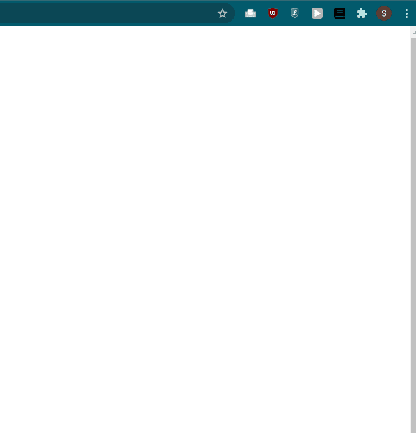

# Word-of-the-Day

Personal project built to practice using web APIs, async functions, Sass, and Google Extensions. User can press refresh button to generate a new word along with the top 3 definitions (if they exist). Currently only activated on my own personal computer as an extension.

Uses Wordnik API to generate a random word, and then search for the definition of that word. Once information is collected, it will be displayed to the user. Cannot make too many requests to Wordnik however, as the free plan only gives a limited number of requests per minute before throwing a 429 HTTP code.

Implemented using async/await functions to handle asynchronous nature of fetch requests when communicating with the Wordnik servers through the API. Errors are handled through a dedicated RenderError.js file which will accept as arguments any error thrown by the try/catch block in index.js.

Initially styled using css since the design was not the primary focus. Later changed it to Sass to better organize code and make it more modifiable in the future. Sass seems like a superior way of organizing css mainly due to the hierarchy structure, but also the use of variables, functions, and mixins.

Finally uploaded it to my Google Chrome browser as an extension. Had to modify webpack.config.js to placate Google on certain security features.

Fun project to simultaneously learn a few new technologies. 
